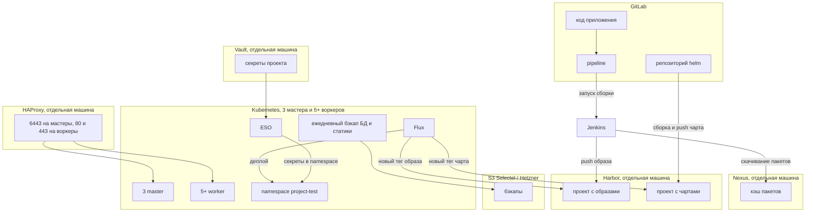

## Как устроено

```mermaid
flowchart TB
  subgraph gitlab["GitLab"]
    code["код приложения"]
    pipe["pipeline"]
    helmgit["репозиторий helm"]
  end

  jenkins["Jenkins"]

  subgraph nexusHost["Nexus, отдельная машина"]
    nexus["кэш пакетов"]
  end

  subgraph harborHost["Harbor, отдельная машина"]
    images["проект с образами"]
    charts["проект с чартами"]
  end

  subgraph lbHost["HAProxy, отдельная машина"]
    haproxy["6443 на мастеры, 80 и 443 на воркеры"]
  end

  subgraph k8s["Kubernetes, 3 мастера и 5+ воркеров"]
    masters["3 master"]
    workers["5+ worker"]
    flux["Flux"]
    eso["ESO"]
    ns["namespace project-test"]
    backup["ежедневный бэкап БД и статики"]
  end

  subgraph vaultHost["Vault, отдельная машина"]
    vault["секреты проекта"]
  end

  subgraph s3["S3 Selectel / Hetzner"]
    bucket["бэкапы"]
  end

  code --> pipe
  pipe -->|"запуск сборки"| jenkins
  jenkins -->|"скачивание пакетов"| nexus
  jenkins -->|"push образа"| images
  helmgit -->|"сборка и push чарта"| charts
  haproxy --> masters
  haproxy --> workers
  flux -->|"новый тег образа"| images
  flux -->|"новый тег чарта"| charts
  flux -->|"деплой"| ns
  vault --> eso
  eso -->|"секреты в namespace"| ns
  backup --> bucket
```
