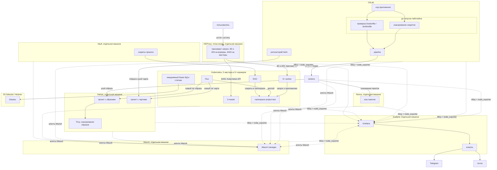

## Как устроено

```mermaid
flowchart TB
  subgraph gitlab["GitLab"]
    code["код приложения"]
    subgraph gates["до запуска пайплайна"]
      secrets["сканирование секретов"]
      lint["проверка Dockerfile / Jenkinsfile"]
    end
    pipe["pipeline"]
    helmgit["репозиторий helm"]
  end

  jenkins["Jenkins"]

  subgraph nexusHost["Nexus, отдельная машина"]
    nexus["кэш пакетов"]
  end

  subgraph harborHost["Harbor, отдельная машина"]
    images["проект с образами"]
    trivy["Trivy, сканирование образов"]
    charts["проект с чартами"]
  end

  user["пользователь"]

  subgraph lbHost["HAProxy, точка входа, отдельная машина"]
    haproxy["принимает запрос: 80 и 443 на воркеры, 6443 на мастеры"]
  end

  subgraph k8s["Kubernetes, 3 мастера и 5+ воркеров"]
    masters["3 master"]
    workers["5+ worker"]
    flux["Flux"]
    eso["ESO"]
    ns["namespace project-test"]
    backup["ежедневный бэкап БД и статики"]
  end

  subgraph vaultHost["Vault, отдельная машина"]
    vault["секреты проекта"]
  end

  subgraph s3["S3 Selectel / Hetzner"]
    bucket["бэкапы"]
  end

  subgraph grafanaHost["Grafana, отдельная машина"]
    grafana["Grafana"]
    alerts["алерты"]
  end

  subgraph wazuhHost["Wazuh, отдельная машина"]
    wazuh["Wazuh manager"]
  end

  telegram["Telegram"]
  mail["почта"]

  code --> secrets
  code --> lint
  secrets --> pipe
  lint --> pipe
  pipe -->|"запуск сборки"| jenkins
  jenkins -->|"скачивание пакетов"| nexus
  jenkins -->|"push образа"| images
  images --> trivy
  helmgit -->|"сборка и push чарта"| charts
  user -->|"HTTP / HTTPS"| haproxy
  haproxy -->|"80 и 443, приложение"| workers
  haproxy -->|"6443, Kubernetes API"| masters
  workers -->|"запрос к приложению"| ns
  flux -->|"новый тег образа"| images
  flux -->|"новый тег чарта"| charts
  flux -->|"деплой"| ns
  vault --> eso
  eso -->|"секреты в namespace"| ns
  backup --> bucket
  gitlab & jenkins & nexusHost & harborHost & lbHost & k8s & vaultHost & wazuhHost -.->|"Alloy + node_exporter"| grafana
  gitlab & jenkins & nexusHost & harborHost & lbHost & k8s & vaultHost & grafanaHost -.->|"агенты Wazuh"| wazuh
  grafana --> alerts
  alerts --> telegram
  alerts --> mail
```
